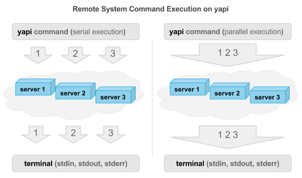

> We should have some ways of connecting programs like garden hose--screw in 
> another segment when it becomes when it becomes necessary to massage data in another way. 
> This is the way of IO also. ~ M. Douglas McIlroy - October 11, 1964  

## yapi - Yet Another Pipe Implementation

[yapi](http://github.com/cmfatih/yapi) is an application inspired by Unix pipeline. 
Currently it can execute remote system commands using ssh protocol. See [examples](#examples)  

For your information; yapi is **still** under heavy development. 
Feedbacks and pull requests are welcome.  

### Installation

#### From binary distributions

| Linux | Mac OSX | FreeBSD | Windows | Source |
|:---:|:---:|:---:|:---:|:---:|
| [64bit](https://github.com/cmfatih/yapi/releases/download/v0.3.1/yapi-linux-amd64.tar.gz) | [64bit](https://github.com/cmfatih/yapi/releases/download/v0.3.1/yapi-darwin-amd64.tar.gz) | [64bit](https://github.com/cmfatih/yapi/releases/download/v0.3.1/yapi-freebsd-amd64.tar.gz) | [64bit](https://github.com/cmfatih/yapi/releases/download/v0.3.1/yapi-windows-amd64.zip) | [tar.gz](https://github.com/cmfatih/yapi/archive/v0.3.1.zip) |
| [32bit](https://github.com/cmfatih/yapi/releases/download/v0.3.1/yapi-linux-386.tar.gz) | [32bit](https://github.com/cmfatih/yapi/releases/download/v0.3.1/yapi-darwin-386.tar.gz) | [32bit](https://github.com/cmfatih/yapi/releases/download/v0.3.1/yapi-freebsd-386.tar.gz) | [32bit](https://github.com/cmfatih/yapi/releases/download/v0.3.1/yapi-windows-386.zip) | [zip](https://github.com/cmfatih/yapi/archive/v0.3.1.zip) |
| [arm](https://github.com/cmfatih/yapi/releases/download/v0.3.1/yapi-linux-arm.tar.gz) | | [arm](https://github.com/cmfatih/yapi/releases/download/v0.3.1/yapi-freebsd-arm.tar.gz) | | |

Latest release **v0.3.1** - see [releases](https://github.com/cmfatih/yapi/releases)

#### From source

```
git clone https://github.com/cmfatih/yapi.git
cd yapi/ && go build yapi.go
```

### Getting started

* Do not forget to make necessary changes in `pipe.json` file before use `yapi` 
  See [config](#config)  
* Add the path of yapi binary file to the `PATH` environment variable or 
  use `./yapi` on Unix-like systems.

-

-

### Usage

#### Help

```
./yapi --help
```

#### Options

```
  -cc       : Client command that will be executed.

  -cn       : Client name(s) those will be connected.
              Use comma (,) for multi-client.

  -cg       : Client group name(s) those will be connected. 
              Use comma (,) for multi-group.

  -ccem     : Execution method for client command. Default; serial
              Possible values; serial (~), parallel (//)

  -pc       : Pipe configuration file. Default; pipe.json

  -help     : Display help and exit.
  -h

  -version  : Display version information and exit.
  -v
```

#### Examples

##### Example 1
```
yapi -cc ls
```
It loads `pipe.json` file in the current working directory. Determine the client by 
`isDefault` value, executes `ls` command on the remote system and displays output.

##### Example 2
```
yapi -cc "tail -F /var/log/syslog" -ccem parallel
```
It loads `/path/pipe.json`, tails `/var/log/syslog` file on the remote system and 
wait until the host process exit.

##### Example 3
```
yapi -cc "top -b -n 1" | grep ssh
```
It executes `top -b -n 1` command on the **remote system**,
transfer result to the **host system**, executes `grep ssh` on the **host system** 
and displays output.

##### Example 4
```
yapi -cn client1 -cc "ps aux" | yapi -cn client2 -cc "wc -l"
```
It executes `ps aux` command on the **remote system** `client1`,
transfer result to the **remote system** `client2`, counts the lines (`wc -l`)
and displays output on the **host system**.

##### Example 5
```
yapi -cc hostname -cn "client1,client2" -ccem parallel
```
It executes `hostname` command on the **remote systems** `client1` and `client2`,
and displays output on the **host system**.

##### Example 6
```
yapi -cc hostname -cg group1 -ccem parallel
```
It executes `hostname` command on the **remote systems** which are part of the
`group1` group, and displays output on the **host system**.

##### Examples for stdin
```
// Unix-like systems
ls | yapi -cc="wc -l"
echo hello | yapi -cc="wc -c"
yapi -cc="wc -w" < README.md
yapi -cc="wc -w" << EOF
yapi -cc="wc -c" <<< hello

// Windows
dir | yapi -cc="wc -l"
echo hello | yapi -cc="wc -c"
yapi -cc="wc -w" < README.md
```

#### Config

yapi checks `-pc` option or `pipe.json` file in the current working directory 
for pipe configuration file. Pipe configuration file contains information about 
clients which is used for remote system connections. Here is the default `pipe.json` file.

```
{
  "clients": [
    {
      "name": "sshtest",
      "groups": ["test"],
      "kind": "ssh",
      "address": "HOST",
      "auth": {
        "username": "USERNAME",
        "password": "PASSWORD",
        "keyfile": ""
      },
      "isDefault": true
    }
  ]
}
```

For ssh clients; `address` and `username` should be defined. `password` and `keyfile` are optional 
and can be used individually or together.  

If you want to use a PuTTY key (`.ppk`) then you have to 
[convert](https://www.google.com/search?q=how+to+convert+ppk+to+id_rsa) it to an OpenSSH key. 
Simply you can use `puttygen YOURKEYFILE.ppk -o id_rsa -O private-openssh` command.
If you get a `structure error` message due key file then please do not use `.ppk` key file.
Create your own SSH keys. See 
[How To Set Up SSH Keys](https://www.digitalocean.com/community/articles/how-to-set-up-ssh-keys--2)

### Notes

* For issues see [Issues](https://github.com/cmfatih/yapi/issues)
* For coding and design goals see [CODING.md](https://github.com/cmfatih/yapi/blob/master/CODING.md)
* For all notable references see [REFERENCES.md](https://github.com/cmfatih/yapi/blob/master/REFERENCES.md)

### Changelog

For all notable changes see [CHANGELOG.md](https://github.com/cmfatih/yapi/blob/master/CHANGELOG.md)

### Contribution

Pull requests are welcome.

### License

Copyright (c) 2014 Fatih Cetinkaya (http://github.com/cmfatih/yapi)  
Licensed under The MIT License (MIT)  
For the full copyright and license information, please view the LICENSE.txt file.